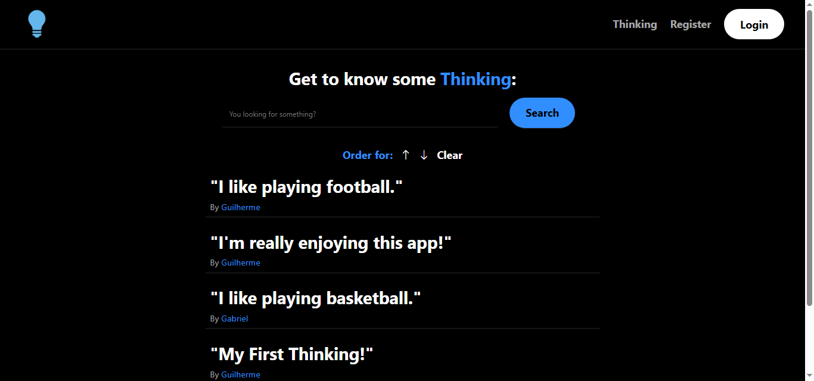
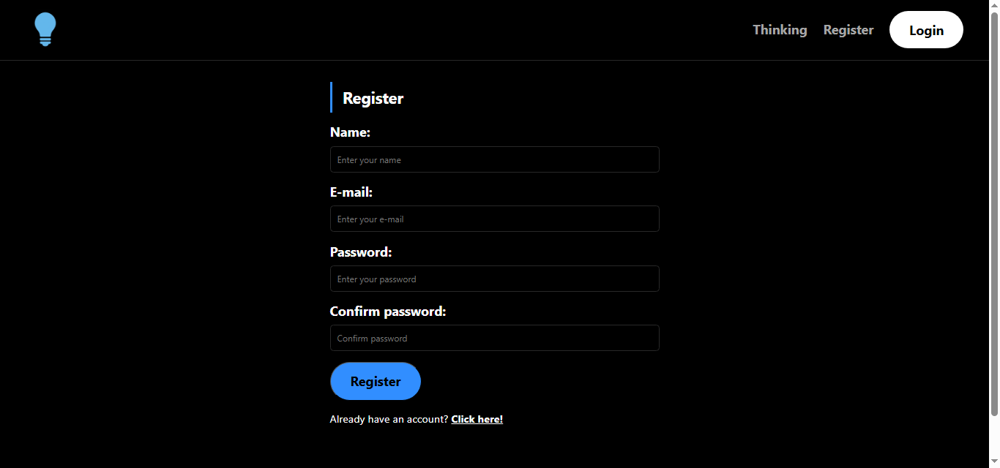
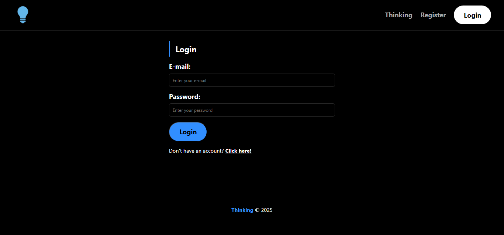
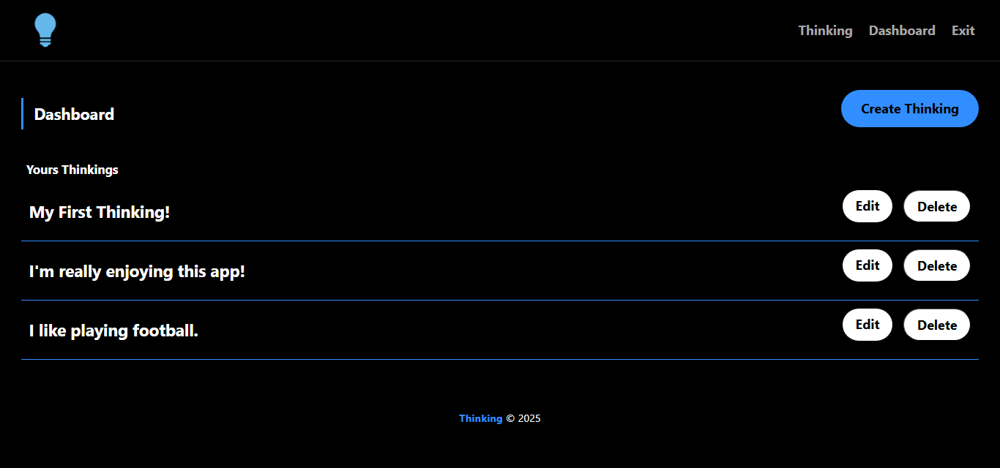
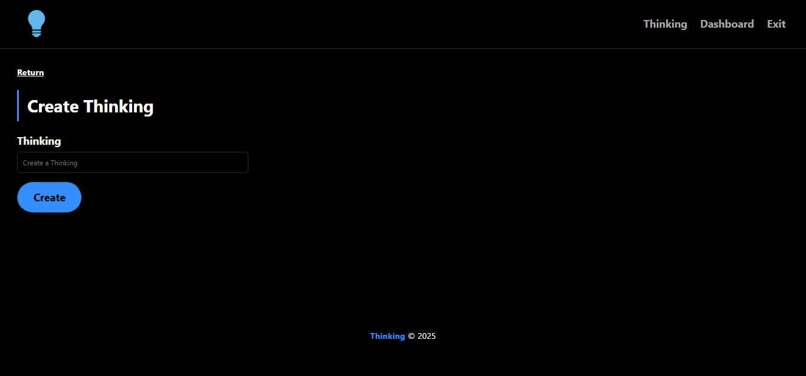
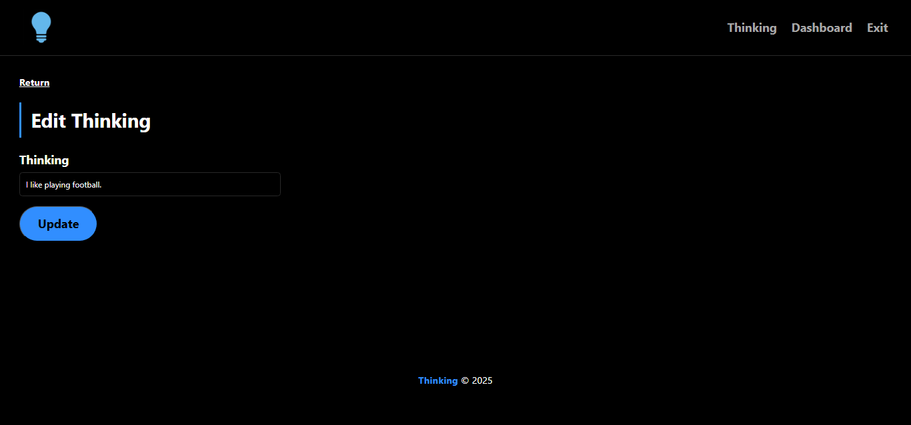

# 🧠 Thinking - Share Your Thoughts

**Thinking** is a full-stack web application that allows users to register, log in, and share their thoughts in a simple social media-like environment. Built using Node.js, Express.js, MySQL, Sequelize and Handlebars, it features full CRUD operations, authentication, search and sorting capabilities.

## 🚀 Features

- Register and log in securely
- Create, read, update, and delete thoughts ("Thinkings")
- Search thoughts by keywords
- Sort thoughts by newest or oldest
- Personal dashboard for managing own thoughts
- Flash messages for feedback
- Session management with file-based storage 

## 🛠️ Technologies Used

- **Node.js**
- **Express.js**
- **MySQL**
- **Sequelize ORM**
- **Express-Handlebars**
- **Bcrypt.js** (for password hashing)
- **Express-Session** & **Session-File-Store**
- **Connect-Flash** / **Express-Flash**
- **Dotenv**

## 📦 Installation

To run the project locally, follow the steps below:

### 1. Clone the repository
    git clone https://github.com/GuillhermeHenrique/thinking
    cd your-repo-name

### 2. Install dependencies
    npm install

### 3. Create a <code>.env</code> file

Configure your database connection:

    DB_NAME=your_database_name
    DB_USER=your_username
    DB_PASSWORD=your_password
    DB_HOST=your_localhost
    DIALECT=mysql

### 4. Start the server
    npm start

### 5. Visit the app

Navigate to <code>http://localhost:3000</code> in your browser.

## 📌 Routes Overview

### 🔐 Authentication

| Method | Route       | Description                  |
|--------|-------------|------------------------------|
| GET    | /login      | Show login page              |
| POST   | /login      | Authenticate user            |
| GET    | /register   | Show registration page       |
| POST   | /register   | Register a new user          |
| GET    | /logout     | Logout and destroy session   |

### 💭 Thinking

| Method | Route                   | Description                    |
|--------|-------------------------|--------------------------------|
| GET    | /thinking/              | Show all thoughts              |
| GET    | /thinking/add           | Show form to add new thought   |
| POST   | /thinking/add           | Save new thought               |
| GET    | /thinking/edit/:id      | Show edit form for a thought   |
| POST   | /thinking/edit          | Update a thought               |
| POST   | /thinking/remove        | Delete a thought               |
| GET    | /thinking/dashboard     | Show user's personal dashboard |

## 📸 Screenshots

### 🏠 Home Page
Search and view recent or old thoughts shared by users

### 🔐 Registration and login page

### ✏️ Dashboard
Easily manage your own thoughts in the dashboard

### ➕ Add or edit a Thought ("Thinking")
Add or edit a thought

## 👨‍💻 Author

Developed by Guilherme Henrique
- **E-mail**: guilhermecafe1010@gmail.com
- **Linkedin**: [/in/guilhermehenriique](https://www.linkedin.com/in/guilhermehenriique)
- **GitHub**: [GuillhermeHenrique](https://github.com/guillhermeHenrique)
